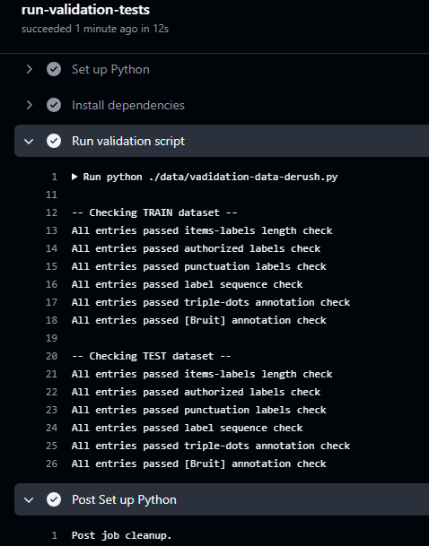

# Automates DATASET TESTING

## What does this job do?

- Check out code: Retrieve the code from the repo.
- Configure Python: Choose the Python version (here 3.11).
- Install dependencies: Install the necessary libraries (e.g., pandas).
- Run validation script: Run your validation-data-derush.py script.
- If the script returns an exit code other than 0 (i.e., if it fails), GitHub Actions will fail the task, and you will see a red status in the Pull Request.

## Expected result of the pipeline

✅ result

