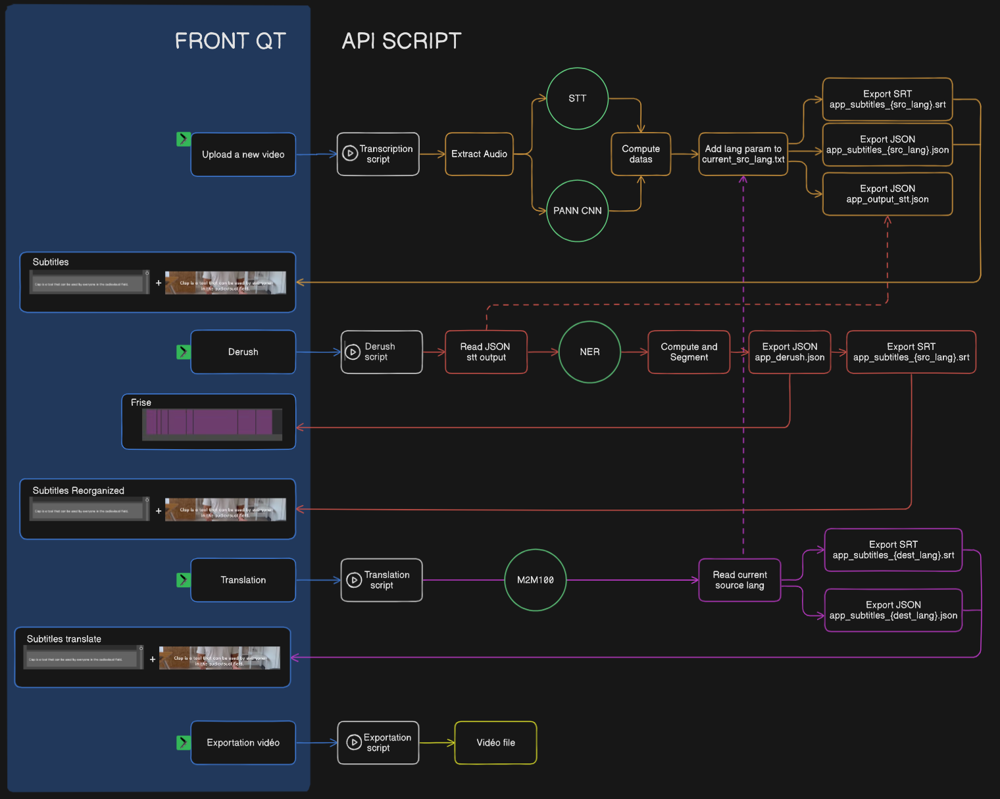

# CLAP AI CORE

Bienvenue dans le projet `clap-ai-core` ! Ce dépôt contient le noyau d'intelligence artificielle pour Clap, un logiciel innovant de dérushage intelligent.

### Structure du projet

```
clap-ai-core/
│
├── API/
│   └── ...  # Application + methods
│   └── models/
│   └── exports /
├── data/
│   └── ...  # Contient les datasets utilisés pour l'entraînement ou l'évaluation des modèles
├── metrics/
│   └── ...  # Contient des notbooks finetuning + XAI
└── requirements.txt  # Liste des lib nécessaires pour exécuter le projet
```

## Prérequis

- Python ≥ 3.11
- install git lfs\* on your machine -> https://git-lfs.com/

> \* Filtre les \*.h5 pour les stocker sur un server lsf

## Setup

```bash
# ativer le virtual env à la racine du projet
# - linux
python3 -m venv venv
source env/bin/activate
# - windows
python -m venv venv
source venv/Scripts/activate


# installer les lib
pip install -r requirements.txt

# deactivate env
deactivate

# API scripts
cd API

# 1). launch the transcription with a video file path argument
# Examples:
python API/app_transcription.py " ~/product_management.mp4" fr
python API/app_transcription.py "./video/Julie_Ng--Rain_rain_and_more_rain.mp4" en

# 2). launch the derush process
python app_derush.py

# 3). run the tanslation with a target language code (dest_lang) argument
# Example:
#   python API/app_translation.py es   # Spanish
#   python API/app_translation.py ar   # Arabic
# To see the full list of valid language codes, check the mapping system here API/utils/map_lang.py
python app_translate.py el

# for dev, use test_dev_<scripts>
# for test the functions one by one and debug log
python test_dev_transcription.py "./video/Julie_Ng--Rain_rain_and_more_rain.mp4"
python test_dev_derush.py
python test_dev_translate.py el

```

**Pour executer un fichier \*.ipynb**  
-> choisir le Kernel env(Python 3.11.x)

### Contribuer

-> Guide de [contribution](CONTRIBUTING.md)

## Configuration des secrets

Dupliquez le fichier `env.example` et renommez la copie en `.env`  
Ce fichier contient les secrets (ex clé d'API). Il ne doit jamais être push sur le repo.

## Fonctionnalités

### 1. Transcription

🗣️📝 **STT**  
---- _Speech to Text_  
Model --> _whisper-base_

🔊🎯 **SED**  
---- _Sound Event Detection_  
Model --> _PANN CNN14_

### 2. Derush

🧾🔍 **NER**  
---- _Name Entity Recognision_  
Model --> _bert-base-multilingual-cased_  
Étude --> [détail des classes](ADR/TA-derush.md)

### 3. Traduction

🌐🔁 MT  
---- _Machine Translation_  
Model --> _M2M100_  
Étude --> [comparative pour fonction de traduction](ADR/TA-translation.md)

### 4. Exportation

Doc --> [détail du script](ADR/TA-exportation-video.md)

## Architerture



## Dataset

-> Documentation about [datasets](./data/README.md)
